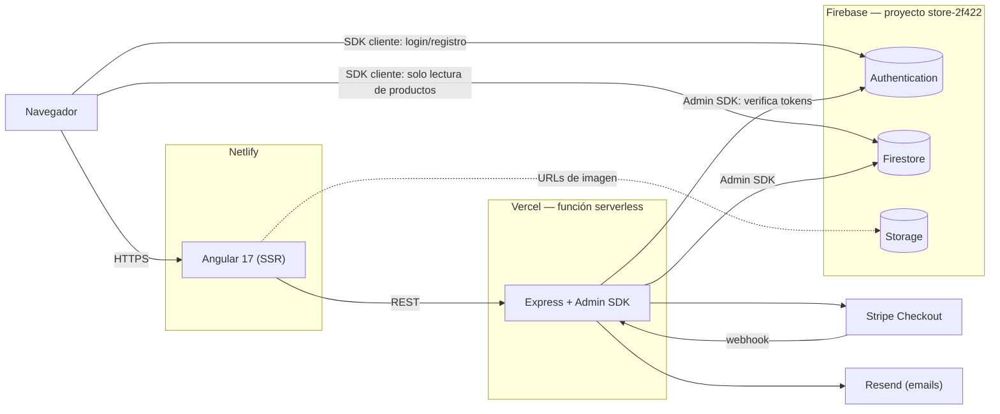
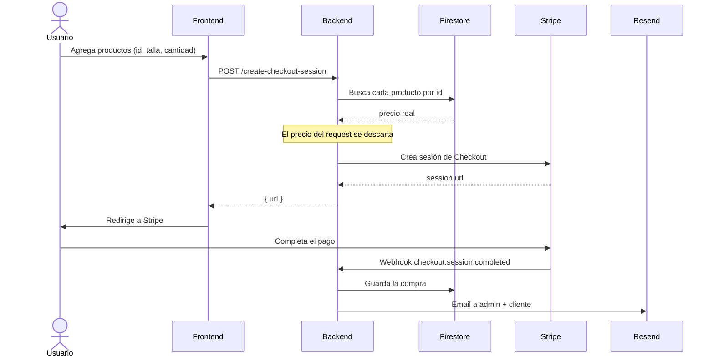

# Tshirt Store

E-commerce de poleras para developers. Angular 17 (SSR) al frente, Express como backend serverless, Firebase como plataforma de datos/auth/storage, y Stripe para los pagos.

- **Producción:** [tshirt-storeop.netlify.app](https://tshirt-storeop.netlify.app)
- **API:** [back-store-mu.vercel.app](https://back-store-mu.vercel.app)
- **Estado del proyecto / roadmap:** [ESTADO.md](ESTADO.md)

---

## Tabla de contenidos

- [Arquitectura](#arquitectura)
- [Decisiones de diseño](#decisiones-de-diseño)
- [Stack](#stack)
- [Modelo de datos](#modelo-de-datos)
- [Seguridad](#seguridad)
- [Flujo de compra](#flujo-de-compra)
- [Estructura del repositorio](#estructura-del-repositorio)
- [Desarrollo local](#desarrollo-local)
- [Variables de entorno](#variables-de-entorno)
- [Testing](#testing)
- [Despliegue](#despliegue)
- [Rutas de la aplicación](#rutas-de-la-aplicación)
- [API del backend](#api-del-backend)

---

## Arquitectura

Tres piezas desplegadas por separado, cada una en la plataforma que mejor le queda, coordinadas a través de Firebase como fuente de verdad compartida.



El frontend nunca habla con Stripe, Resend ni con la colección `compras` directamente — todo pasa por el backend, que es el único que tiene la clave de Stripe y la cuenta de servicio de Firebase Admin.

## Decisiones de diseño

Estas son las decisiones que probablemente generen preguntas al leer el código, con la razón detrás:

- **El backend usa el Admin SDK de Firebase, no el SDK cliente.** El código server-side necesita ignorar las reglas de seguridad de Firestore (para leer `compras` de cualquier usuario al procesar el webhook, por ejemplo) y verificar tokens de ID — ninguna de las dos cosas es el trabajo del SDK cliente. Ver [`backend/index.js`](backend/index.js).

- **El precio de un producto nunca se toma del request del cliente.** `create-checkout-session` recibe `id`, `talla` y `cantidad`, pero busca el precio real en Firestore antes de crear la sesión de Stripe. Confiar en el precio que manda el navegador es una vulnerabilidad clásica de e-commerce (editable desde devtools).

- **`compras` está bloqueada a nivel de reglas de Firestore** (`allow read, write: if false`) — solo el backend con Admin SDK puede tocarla. El historial de compras de un usuario se pide al backend con su token, que filtra server-side por email; el cliente nunca ve compras ajenas.

- **Las imágenes viven en Firebase Storage, no en el bundle de Angular.** Antes estaban hardcodeadas como `assets/img/{id}.jpg`; ahora cada producto guarda su URL de Storage en el campo `imagen` de Firestore, así que agregar un producto nuevo no requiere redesplegar el frontend. Ver [`backend/scripts/migrar-imagenes.js`](backend/scripts/migrar-imagenes.js).

- **SSR con Angular Universal** para tener HTML renderizado en la primera carga (SEO, tiempo a contenido visible) sin renunciar a que siga siendo una SPA una vez hidratada.

- **El carrito vive en `localStorage`**, no en Firestore. Es un carrito de invitado por diseño — no hace falta cuenta para comprar, solo para ver el historial después.

## Stack

| Capa | Tecnología |
|---|---|
| Frontend | Angular 17 (standalone components, SSR/Angular Universal) |
| Backend | Node.js + Express, desplegado como función serverless en Vercel |
| Base de datos | Firebase Firestore |
| Archivos | Firebase Storage |
| Auth | Firebase Authentication (email/password + Google) |
| Pagos | Stripe Checkout |
| Emails | Resend |
| Testing | Jest (`jest-preset-angular`) |

## Modelo de datos

### `productos`

Lectura pública, escritura solo desde la consola de Firebase o el script de migración (ningún endpoint del backend escribe productos hoy).

```ts
{
  // id del documento = id del producto en toda la app
  nombre: string;
  precio: number;
  descripcion: string;
  cantidad: number;   // stock declarado — no se descuenta en checkout todavía, ver ESTADO.md
  imagen: string;      // URL pública de Firebase Storage
}
```

### `compras`

Sin lectura ni escritura directa del cliente — solo la escribe el webhook de Stripe y solo la lee `GET /compras` (autenticado), ambos vía Admin SDK.

```ts
{
  // id del documento = session id de Stripe
  sessionId: string;
  paymentIntent: string;
  nombre: string;
  email: string;
  direccion: string;
  ciudad: string;
  region: string;
  postal: string;
  total: number;
  estado: string;            // 'completado'
  productos: {
    nombre: string;
    cantidad: number;
    total: number;
  }[];
  fecha: Timestamp;
}
```

## Seguridad

- [`firestore.rules`](firestore.rules) y [`storage.rules`](storage.rules): catálogo de lectura pública, todo lo demás denegado por defecto al cliente.
- Middleware `verificarToken` en el backend valida el ID token de Firebase (`Authorization: Bearer <token>`) antes de servir `/compras`.
- Validación server-side de talla/cantidad/precio en `/create-checkout-session` (ver [Decisiones de diseño](#decisiones-de-diseño)).
- Verificación de firma en el webhook de Stripe (`stripe.webhooks.constructEvent`).
- Rutas privadas del frontend (`/history`, `/tracking`) protegidas con [`authGuard`](src/app/auth/auth.guard.ts).

## Flujo de compra



## Estructura del repositorio

```
tshirt-store/
├── src/                    # Angular (frontend)
│   └── app/
│       ├── auth/           # AuthService, guard, login/register
│       ├── carrito/        # Página de carrito
│       ├── descripcion/    # Detalle de producto
│       ├── pag-inicio/     # Home / catálogo
│       ├── user/           # Historial de compras, tracking
│       └── menu/           # Header/nav
├── backend/                 # Express (desplegado aparte en Vercel)
│   ├── index.js             # Rutas, middleware, integración Stripe/Resend
│   └── scripts/             # Migración de imágenes a Storage
├── firestore.rules
├── storage.rules
├── firebase.json
└── ESTADO.md                 # Qué está resuelto y qué falta
```

## Desarrollo local

Requiere Node.js y una cuenta con acceso al proyecto de Firebase `store-2f422` (o uno propio).

```bash
# Frontend
npm install
npm start              # http://localhost:4200

# Backend (en otra terminal)
cd backend
npm install
cp .env.example .env   # completar con tus credenciales
node index.js           # http://localhost:3000
```

Por defecto el frontend apunta al backend de producción ([`servico.service.ts`](src/app/servico.service.ts)) — para probar contra tu backend local, cambiá esa URL temporalmente.

## Variables de entorno

Ver [`backend/.env.example`](backend/.env.example) para la lista completa. Resumen:

| Variable | Para qué |
|---|---|
| `STRIPE_SECRET_KEY`, `STRIPE_WEBHOOK_SECRET` | Checkout y verificación del webhook |
| `RESEND_API_KEY`, `EMAIL_TO` | Envío de emails de confirmación |
| `FIREBASE_PROJECT_ID` | Proyecto de Firebase |
| `FIREBASE_CLIENT_EMAIL`, `FIREBASE_PRIVATE_KEY` | Cuenta de servicio para el Admin SDK — se generan en Firebase Console → Configuración del proyecto → Cuentas de servicio |

El frontend no necesita `.env`: su config de Firebase (pública, no secreta) está en [`app.config.ts`](src/app/app.config.ts).

## Testing

```bash
npm test -- --watch=false
```

Suite de Angular/Jest sobre componentes y servicios del frontend. El backend no tiene tests todavía (ver [ESTADO.md](ESTADO.md)).

## Despliegue

| Pieza | Dónde | Cómo |
|---|---|---|
| Frontend | Netlify | Deploy automático desde el repo |
| Backend | Vercel (proyecto `back-store`) | `vercel --prod` desde `backend/`, o deploy automático si está linkeado a git |
| Reglas de Firestore/Storage | Firebase | `firebase deploy --only firestore:rules,storage` |

## Rutas de la aplicación

| Ruta | Componente | Acceso |
|---|---|---|
| `/` | Catálogo | Público |
| `/descripcion/:id` | Detalle de producto | Público |
| `/carrito` | Carrito | Público |
| `/nosotros` | Nosotros | Público |
| `/login`, `/register` | Auth | Público |
| `/success`, `/cancel` | Resultado de pago | Público |
| `/history` | Historial de compras | 🔒 Requiere sesión |
| `/tracking` | Seguimiento de pedido | 🔒 Requiere sesión (en construcción) |

## API del backend

Base: `https://back-store-mu.vercel.app`

### `GET /productos`

Catálogo completo. Sin autenticación.

```json
[{ "id": "1", "nombre": "React", "precio": 5000, "descripcion": "...", "imagen": "https://..." }]
```

### `POST /create-checkout-session`

Crea una sesión de Stripe Checkout. El precio se recalcula server-side a partir del `id` — el `precio` que se mande en el body se ignora.

```json
// Body
{
  "productos": [
    { "id": "1", "talla": "M", "cantidad": 2 }
  ]
}

// Respuesta
{ "id": "cs_...", "url": "https://checkout.stripe.com/..." }
```

### `POST /stripe-webhook`

Recibe `checkout.session.completed` de Stripe (firma verificada), guarda la compra en Firestore y dispara los emails de confirmación. No pensado para llamarse manualmente.

### `GET /compras`

Historial de compras del usuario autenticado. Requiere `Authorization: Bearer <idToken>`; devuelve solo las compras cuyo email coincide con el del token.

```json
[{ "sessionId": "cs_...", "total": 15000, "estado": "completado", "productos": [...] }]
```

---

**Autor:** Pedro Basualto
